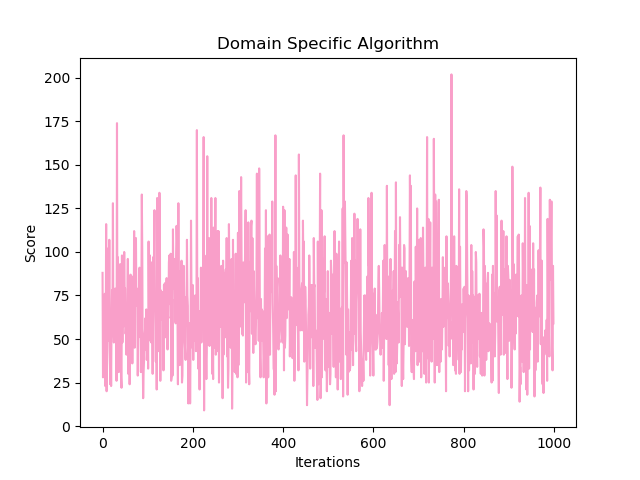

# SnakeAI
AI for the popular snake game. It makes use of __A* search algorithm__ with _g(n)_ set to 0; in other words, the cost to reach current node from previous node is not kept track of.

# A* Search Algorithm
[Read here](https://en.wikipedia.org/wiki/A*_search_algorithm)

# Performance

